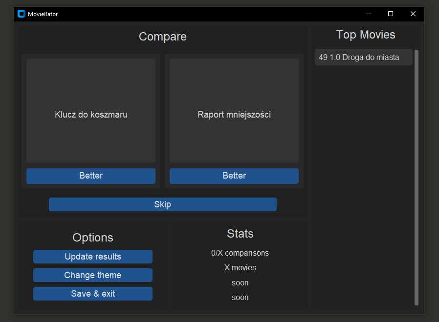

# Movie Rator
Minimalistic app for rating (comparing) movies.

<div style="text-align:center">
    
</div>

### Getting Started

1. Clone this repository
   ```bash
   git clone https://github.com/Macck209/movie-rator
2. Install dependencies
   ```bash
   pip install -r requirements.txt --upgrade
3. Run the script
   ```bash
   python movie-rator.py
### Important info
This is a **hobby project**, meaning all features are limited to what I care about.